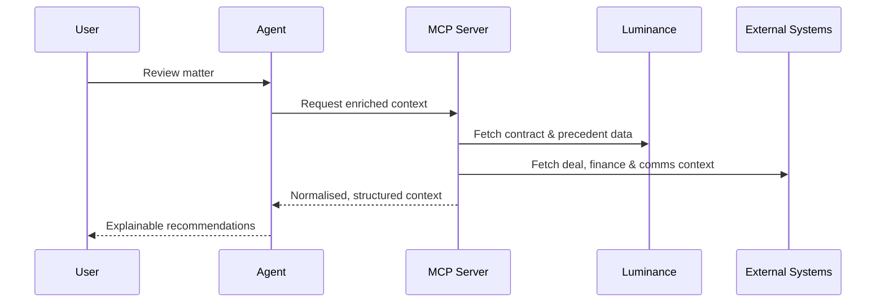

# Luminance Integration MCP Server
**Build Something Brilliant - Competition Entry**

---

## Table of Contents
1. Competition Overview
2. Updated Problem Statement
3. Why This Problem Matters
4. Our Solution
5. High-Level Architecture
6. Agentic Layer
7. MCP Server Layer
8. How Context Is Unlocked (Sequence Diagram)
9. MCP Server Responsibilities
10. Agent & UI Integration
11. Repository Structure
12. Running Locally
13. Security, Governance & Auditability

---

## 1. Competition Overview

**Build Something Brilliant** encourages teams at Luminance to explore how our platform, APIs, and AI capabilities can be extended in innovative but realistic ways.

This submission focuses on a core strategic question for Luminance's future:

> How do we unlock the *full commercial and operational context* around contracts when that context increasingly lives **outside** Luminance?

---

## 2. Updated Problem Statement

### What Luminance Already Does Well

Luminance is already excellent at:
- Comparing contract versions **within** Luminance
- Analysing negotiated positions against internal precedent
- Identifying risk, deviations, and clause-level changes once documents are inside the platform

This is *not* the problem we are trying to solve.

---

### The Real Problem: Context Is Fragmented

In modern organisations, the most important signals for contract decisions live **outside** the contract repository:
- **Salesforce** - deal value, account tier, close probability, renewal risk
- **Sage / ERP systems** - revenue recognition, payment history, credit risk
- **Slack / email** - negotiation pressure, urgency, internal alignment
- **Procurement & CRM tools** - supplier importance, historical concessions

As a result:
- Legal teams must mentally stitch together context from multiple systems
- Critical commercial nuance never reaches the contract review surface
- AI systems operating on contracts alone lack decision-critical inputs

> The contract is only one part of the decision.  
> The *context* determines how that contract should be handled.

---

## 3. Why This Problem Matters

Without access to external context:
- "Market standard" advice is incomplete
- Signing likelihood estimates are shallow
- Clause recommendations are blind to commercial reality
- Legal teams over-review low-risk deals and under-prioritise high-impact ones

This creates:
- Slower deal velocity
- Friction between Legal, Sales, and Finance
- Missed opportunities for intelligent automation

---

## 4. Our Solution

We introduce a **Model Context Protocol (MCP)-based integration layer** that allows AI agents to:
- Pull *relevant external context* at the moment of contract decision-making
- Combine that context with Luminance's deep contract intelligence
- Surface **explainable, human-reviewable recommendations** inside Luminance

Key principles:
- Context is *fetched, not duplicated*
- AI proposes; humans approve
- Luminance remains the system of record for legal decisions

---

## 5. High-Level Architecture

```mermaid
flowchart LR
  subgraph Agentic Layer
    User[Legal User<br/>Matter Insights UI]
    Agent[AI Agent / Orchestrator]
    Prismatic[Prismatic MCP Flow Server<br/>(optional)]
    User --> Agent
    Agent --> Prismatic
  end

  subgraph MCP Server Layer
    MCP[Integration MCP Server<br/>(HTTP wrapper)]
    StdioMCP[Stdio MCP Server<br/>(Prismatic/CLI)]
  end

  subgraph Sources
    Lum[Luminance API]
    SF[Salesforce MCP]
    ERP[ERP / Sage MCP]
    Slack[Slack MCP]
  end

  Prismatic --> MCP
  Agent --> MCP
  Agent --> StdioMCP

  MCP --> Lum
  MCP --> SF
  MCP --> ERP
  MCP --> Slack
```

---

## 6. Agentic Layer

The Agentic layer is responsible for:
- Interpreting user intent (Matter Insights UI)
- Selecting the right MCP tool to call
- Combining MCP results into a human-readable response
- Ensuring actions remain assistive, not autonomous

This layer can run:
- Inside Prismatic (via MCP Flow Server)
- In a custom orchestrator or LLM runtime

---

## 7. MCP Server Layer

The MCP Server layer provides **audited, structured access** to Luminance and external systems:

- **HTTP MCP Wrapper (`mcp/`)**
  - Production-grade FastAPI wrapper
  - Stable HTTP endpoints for agents
  - Strong auth, observability, retries, and caching

- **Stdio MCP Server (`components/luminance-mcp/integration_mcp/`)**
  - JSON-RPC over stdio
  - Useful for Prismatic-hosted flows and local prototyping

---

## 8. How Context Is Unlocked



---

## 9. MCP Server Responsibilities

The Integration MCP Server is responsible for:
- **Context aggregation**
  - Matter (Group) data from Luminance
  - Commercial and operational data from external systems
- **Semantic tooling**
  - Version comparison
  - Clause similarity across precedent
  - Context-aware filtering
- **Governance**
  - Rate limiting, retries, and error handling
  - Provenance tracking
  - Security and access control

This keeps the agent lightweight and safe.

---

## 10. Agent & UI Integration

### UI (Matter / Group Insights)
- Displays AI summaries, recommended actions, and tags
- Clearly shows *why* something is suggested
- Requires explicit user approval before execution

### Agent
- Orchestrates calls across MCP servers
- Combines legal and external context
- Never executes actions autonomously

### MCP Contract
Every response includes:
- Structured data
- Source references
- Confidence indicators
- Human-review flags

---

## 11. Repository Structure

```
mcp-project/
|-- mcp/                      # HTTP MCP wrapper (FastAPI)
|-- components/luminance-mcp/integration_mcp/  # Stdio MCP server (Prismatic/CLI)
|-- components/               # Component-level docs and links
|   |-- luminance-mcp/
|   |-- salesforce-mcp/
|   |-- ai-insights-ui/
|   `-- agentic-layer/
|-- docs/                     # Overview + doc index
|   |-- overview/
|   `-- README.md
|-- tests/
`-- deploy/
```

---

## 12. Running Locally

For full local setup instructions:
- **HTTP MCP Wrapper**: `components/luminance-mcp/docs/MCP_WRAPPER.md`
- **Luminance UI demo**: `components/ai-insights-ui/docs/luminance-local/RUN_LOCAL_LUMINANCE.md`

---

## 13. Security, Governance & Auditability

- OAuth2 / Bearer token authentication
- Structured logging and request IDs
- Provenance tracking for every response
- No autonomous execution

---
